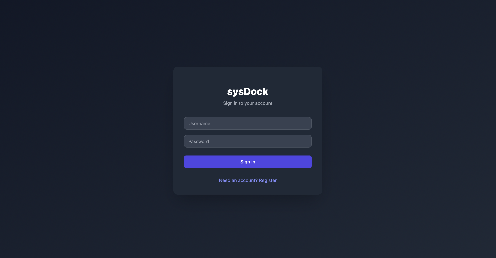
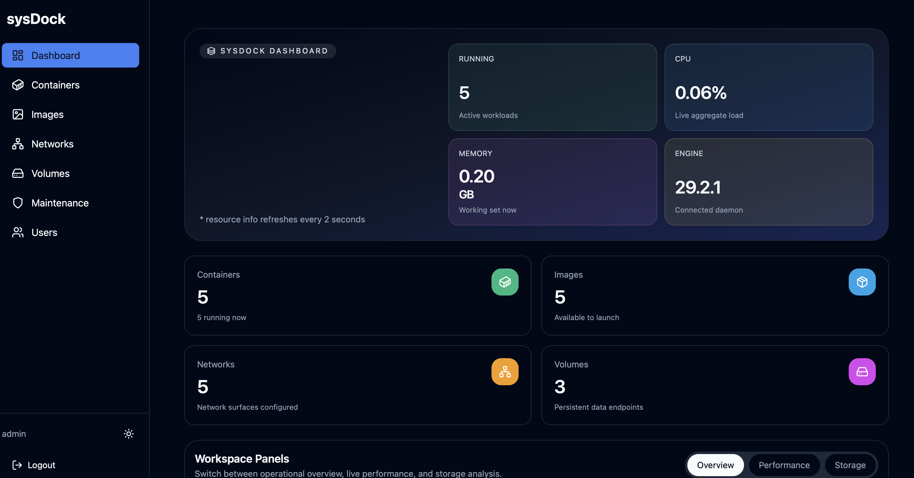
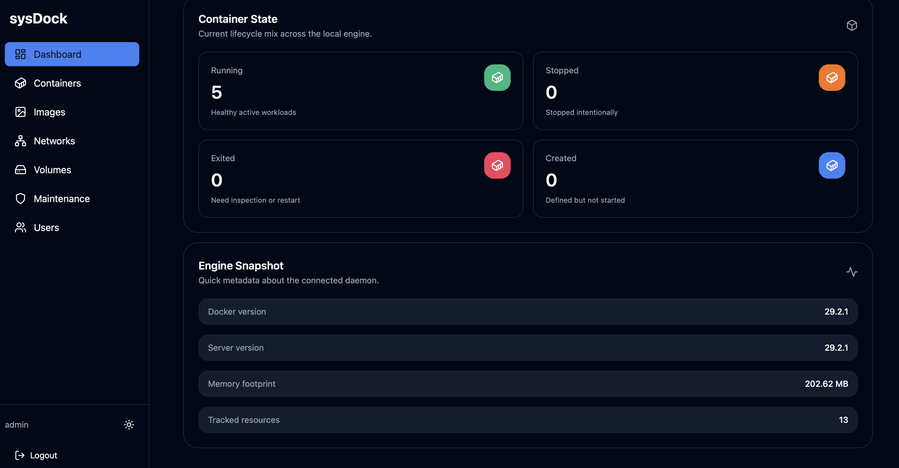
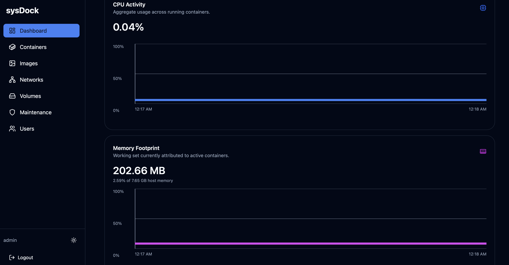
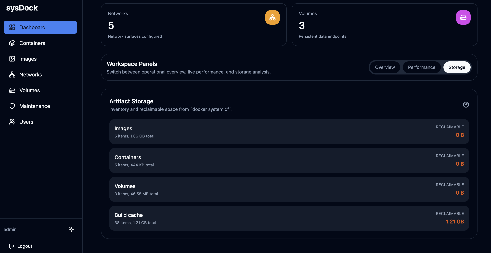
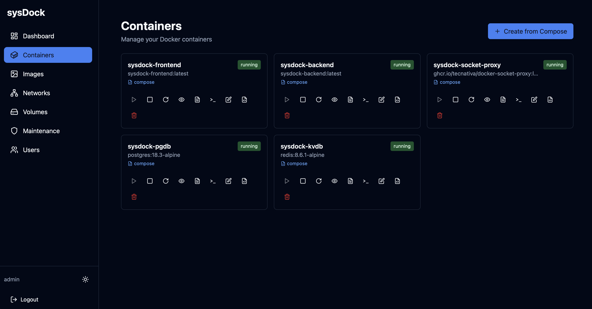
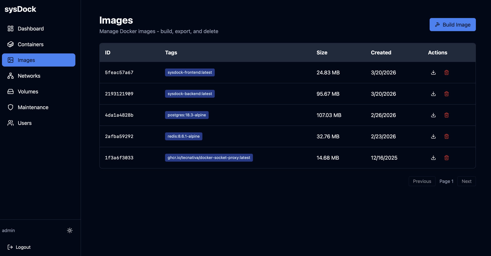
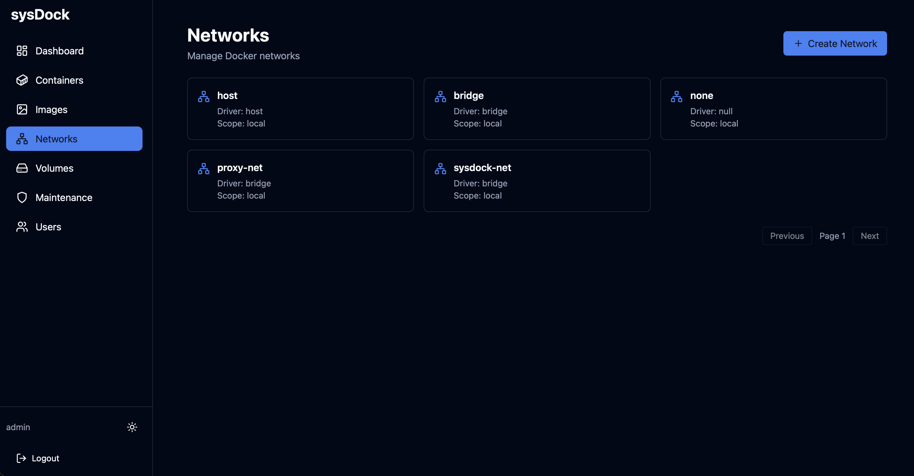
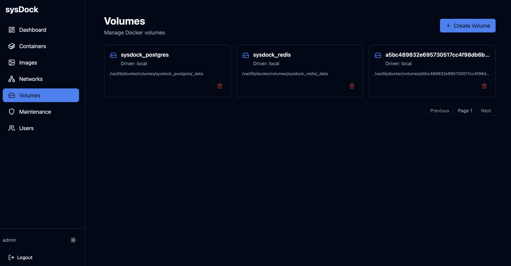
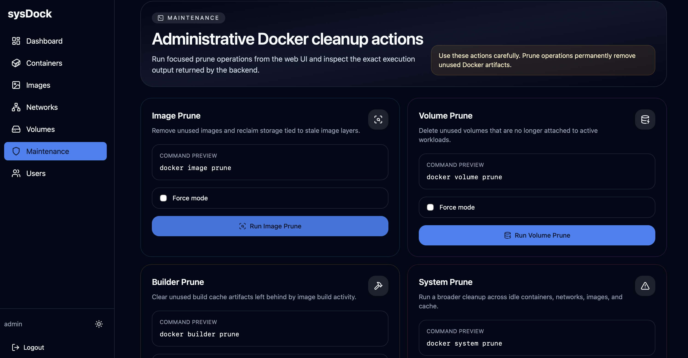

# sysDock

sysDock is a browser-based Docker management application for small teams and local infrastructure. It combines a FastAPI backend, a React frontend, PostgreSQL for persisted application data, Redis for short-lived caching, and a Docker socket proxy that narrows which Docker APIs the app can reach.

The goal is simple: give administrators and viewers a usable Docker dashboard without requiring everyone to work directly in the terminal.

## What the App Does

- shows live Docker system status on the dashboard
- lists and inspects containers, images, networks, and volumes
- streams container logs in the browser
- supports admin-only interactive container shell access
- supports admin-only container lifecycle and edit actions
- supports admin-only image, network, and volume mutations
- supports admin-only maintenance actions for prune workflows
- supports compose-based create and update flows where supported
- keeps short-term performance history for CPU and memory charts

## Roles and Access

sysDock uses an approval-based role model.

- The first user who registers becomes the initial `Administrator`.
- Every later registration is created in a pending state until an administrator approves it.
- Administrators have full access to the application, including mutations, shell access, and the Users page.
- Viewers can inspect and read data, but they cannot start, stop, restart, delete, edit, or shell into containers, and they do not get access to user administration.

## Main Areas

### Dashboard

- live counts for containers, images, networks, and volumes
- hero cards for key runtime indicators
- performance history for CPU and memory
- CPU and memory charts scale with available space and use percentage-based vertical axes
- memory trend lines are shown relative to total host memory, while the line itself reflects Docker container memory usage
- overview, performance, and storage-oriented workspace panels

### Containers

- browse running and stopped containers
- inspect detailed metadata
- view recent logs or live log streams
- start, stop, restart, rename, edit, or remove containers as an administrator
- open an admin-only shell using `/bin/sh` or `/bin/bash`
- create or update supported compose-backed workloads

### Images

- inspect images
- build images from Dockerfile content
- export images
- perform admin-only image lifecycle actions

### Networks

- inspect Docker networks
- create or delete networks as an administrator
- connect or disconnect containers where supported

### Volumes

- inspect named volumes
- create and delete volumes as an administrator
- review attachment and mount information

### Maintenance

- available only to administrators
- run `image prune`, `volume prune`, `builder prune`, and `system prune`
- supports force-mode variants for cleanup actions
- shows backend execution output for both successful and failed runs

### Users

- available only to administrators
- approve newly registered users
- assign `Administrator` or `Viewer` role

## Screenshots

Click any screenshot to open the full-size image.

<p align="center">
  <a href="pictures/1_login_screen.png">
    
  </a>
  <a href="pictures/2_dashboard_page.png">
    
  </a>
  <a href="pictures/3_dashboard_container_state.png">
    
  </a>
</p>

<p align="center">
  <a href="pictures/4_dashboard_resource_graphs.png">
    
  </a>
  <a href="pictures/5_dashboard_artifact_storage.png">
    
  </a>
  <a href="pictures/6_containers_page.png">
    
  </a>
</p>

<p align="center">
  <a href="pictures/7_images_page.png">
    
  </a>
  <a href="pictures/8_networks_page.png">
    
  </a>
  <a href="pictures/9_volumes_page.png">
    
  </a>
</p>

<p align="center">
  <a href="pictures/10_maintenance_page.png">
    
  </a>
</p>

## Architecture

### Frontend

- React + TypeScript + Vite
- TanStack Query for server-state fetching
- Zustand for auth state
- Nginx in the production container
- HTTPS termination at the frontend container

### Backend

- FastAPI
- SQLAlchemy async + Alembic migrations
- Redis-backed short-lived caching for selected Docker/system responses
- Docker SDK for Python

### Supporting Services

- PostgreSQL
- Redis
- `tecnativa/docker-socket-proxy`

## Security Model

sysDock has a reasonable security baseline for internal beta use, but it is not the same thing as a fully hardened production platform.

### What is already in place

- HTTP-only session cookie for browser auth
- CSRF validation on unsafe cookie-authenticated requests
- bcrypt password hashing for stored user passwords
- role-based access control for admin-only mutations
- approval flow for new users after the first admin account
- Docker access mediated through a socket proxy instead of exposing the raw Docker socket directly
- HTTPS served by Nginx with redirect from HTTP to HTTPS
- secure cookie support enabled for HTTPS deployments
- rate limits on login, registration, and several mutation endpoints
- admin-only container shell access with confirmation and server-side controls
- admin-only maintenance endpoints for Docker cleanup workflows

### How `SECRET_KEY` is used

`SECRET_KEY` is used to sign and verify the JWT session token stored in the auth cookie. It is not used to encrypt database rows, Redis contents, or other stored application data.

In other words:

- `SECRET_KEY` protects token integrity and authenticity
- it does not provide encryption-at-rest for PostgreSQL or Redis data
- changing it invalidates existing signed sessions

### What is stored securely vs not encrypted

- Passwords are stored as bcrypt hashes, not plain text.
- Session tokens are signed JWTs in cookies.
- Application data in PostgreSQL is not field-encrypted by the app.
- Redis cache contents are not encrypted by the app.

### Practical assessment

For a first beta on a trusted internal network, the current setup is decent. For a broader or less-trusted deployment, you should still consider this a starting point rather than a finished security posture.

The biggest remaining gaps are:

- no built-in encryption-at-rest for application data
- no MFA, SSO, or external identity integration
- no email ownership verification for registrations
- stateless JWT sessions are signed, but not centrally revocable without changing session state design or rotating the secret
- Docker admin actions are inherently powerful, especially shell access
- `.env`, certificates, and Docker host access still need strong operational handling

## Requirements

- Docker Engine
- `docker compose`
- permission to access the local Docker daemon
- certificate and private key files for HTTPS in the `certs/` directory

## Quick Start

1. Review and edit [`.env`](.env).
2. Place your server certificate and private key in [`certs/`](certs/).
3. Build and start the stack with Docker Compose.
4. Open the application over HTTPS.
5. Register the first user account.

## Environment Variables

The main deployment settings are managed from [`.env`](.env).

```env
APP_NAME=sysDock
APP_VERSION=1.0.0
DEBUG=False

SECRET_KEY=replace-me-with-a-long-random-secret
ALGORITHM=HS256
ACCESS_TOKEN_EXPIRE_MINUTES=1440
COOKIE_SECURE=True
COOKIE_SAMESITE=strict

ENABLE_CONTAINER_SHELL=True
CONTAINER_SHELL_IDLE_TIMEOUT_SECONDS=1800
CONTAINER_SHELL_MAX_COLS=240
CONTAINER_SHELL_MAX_ROWS=80

POSTGRES_CONTAINER_NAME=sysdock-pgdb
REDIS_CONTAINER_NAME=sysdock-kvdb
SOCKET_PROXY_CONTAINER_NAME=sysdock-socket-proxy
BACKEND_CONTAINER_NAME=sysdock-backend
FRONTEND_CONTAINER_NAME=sysdock-frontend
DOCKER_NETWORK_NAME=sysdock-net
POSTGRES_VOLUME_NAME=sysdock_postgres
REDIS_VOLUME_NAME=sysdock_redis

POSTGRES_IMAGE=postgres:16-alpine
REDIS_IMAGE=redis:7-alpine
SOCKET_PROXY_IMAGE=ghcr.io/tecnativa/docker-socket-proxy:latest

FRONTEND_HTTP_HOST_PORT=80
FRONTEND_HTTP_CONTAINER_PORT=80
FRONTEND_HOST_PORT=443
FRONTEND_CONTAINER_PORT=443
FRONTEND_SERVER_NAME=localhost
FRONTEND_TLS_CERT_FILENAME=custom-server.crt
FRONTEND_TLS_KEY_FILENAME=custom-server.key

BACKEND_CONTAINER_PORT=8000
POSTGRES_PORT=5432
REDIS_PORT=6379
SOCKET_PROXY_PORT=2375

POSTGRES_USER=sysdock-pg-user
POSTGRES_PASSWORD=replace-me
POSTGRES_HOST=sysdock-pgdb
POSTGRES_DB=sysdock-pg-db

REDIS_HOST=sysdock-kvdb
REDIS_DB=0

DOCKER_HOST=tcp://sysdock-socket-proxy:2375
BACKEND_CORS_ORIGINS=["https://localhost"]
```

Notes:

- `SECRET_KEY` should be long, random, and unique per deployment.
- `COOKIE_SECURE=True` should stay enabled when serving over HTTPS.
- `FRONTEND_HTTP_HOST_PORT=80` is used for redirecting plain HTTP traffic to HTTPS.
- `FRONTEND_TLS_CERT_FILENAME` and `FRONTEND_TLS_KEY_FILENAME` must match files placed in `certs/`.

## HTTPS Deployment

The frontend container terminates TLS and also listens on plain HTTP only to redirect traffic to HTTPS.

Place these files in [`certs/`](certs/):

- your server certificate, such as `custom-server.crt`
- your server private key, such as `custom-server.key`

If your certificate is signed by a private or internal Root CA, that Root CA must be trusted on client machines or browsers. The application does not need the Root CA file to serve HTTPS to browsers in the normal case.

Certificate guidance:

- The server certificate should include a Subject Alternative Name for the exact hostname users will use to access sysDock.
- If you expect users to access the app by IP address, that IP must also be present as an IP SAN in the certificate.
- In practice, hostname access is the recommended and more reliable deployment pattern, especially for secure WebSocket features such as the interactive container shell.
- A certificate that is accepted for page load is not always enough for every browser/WebSocket path when connecting by raw IP, so using a real hostname is the expected setup.
- `FRONTEND_SERVER_NAME` in [`.env`](.env) should match the primary hostname used for the deployment.

## Host Prerequisites

Redis persistence may warn or fail on Linux hosts where memory overcommit is disabled. Because `vm.overcommit_memory` is a host kernel setting, it cannot be reliably fixed from this Compose application itself.

Before deploying on a new server, verify that the host reports:

```bash
sysctl vm.overcommit_memory
```

Expected value:

```bash
vm.overcommit_memory = 1
```

To apply it immediately on the host:

```bash
sudo sysctl vm.overcommit_memory=1
```

To make it persistent across reboots:

```bash
echo 'vm.overcommit_memory = 1' | sudo tee /etc/sysctl.d/99-sysdock.conf
sudo sysctl --system
```

This repository also includes a simple preflight checker you can run before `docker compose up`:

```bash
./scripts/check-host-prereqs.sh
```

## Start the Stack

```bash
docker compose up --build
```

When the stack is ready:

- `http://localhost` redirects to HTTPS
- frontend: `https://localhost`

To stop everything:

```bash
docker compose down
```

## First-Time Setup

1. Open `https://localhost`.
2. Register the first account.
3. The first registered account becomes the initial administrator automatically.
4. After that, additional registrations remain pending until an administrator approves them from the Users page.

## Local Development

### Backend

```bash
cd backend
./start.sh
```

Or:

```bash
cd backend
uvicorn app.main:app --reload --port 8000
```

### Frontend

```bash
cd frontend
npm install
npm run dev
```

The Vite dev server runs on `http://localhost:3000` and proxies `/api` requests to the backend.

## Important Limitations

- Compose operations depend on the backend being able to locate a real `docker-compose.yml` for the target workload.
- Compose files with `build` contexts are not supported from the web UI.
- Relative bind mounts in submitted Compose payloads are not supported from the web UI.
- Shell access is intentionally restricted to administrators.
- Shell access is still effectively equivalent to interactive access inside a running container, so it should be treated as a privileged operation.
- Maintenance actions are intentionally restricted to administrators because prune operations can permanently delete Docker artifacts.
- The app signs auth sessions, but it does not encrypt application data at rest.

## Useful Endpoints

- `GET /api/auth/me`
- `GET /api/docker/system`
- `GET /api/docker/system/history`
- `GET /health`

API docs are disabled by default unless explicitly enabled in backend configuration.

## Repository Layout

```text
backend/
  app/
    api/        FastAPI routes
    core/       config, security, rate limiting
    db/         database and Redis wiring
    models/     SQLAlchemy models
    schemas/    Pydantic schemas
    services/   Docker integration logic
  alembic/      database migrations

frontend/
  src/
    components/ shared UI
    contexts/   app-wide providers
    lib/        API helpers
    pages/      major screens
    stores/     auth and local state
```

## Troubleshooting

If the frontend container restarts during HTTPS startup:

- verify the cert file named by `FRONTEND_TLS_CERT_FILENAME` exists in `certs/`
- verify the key file named by `FRONTEND_TLS_KEY_FILENAME` exists in `certs/`
- inspect frontend container logs for Nginx startup errors

If the dashboard loads but Docker data is missing:

- verify Docker is running on the host
- check the `socket-proxy` and `backend` containers
- confirm the backend can reach `tcp://sysdock-socket-proxy:2375`

If login works but actions fail:

- make sure cookies are allowed for `localhost`
- confirm the request is going through `/api`
- inspect backend logs for auth, CSRF, or Docker validation errors

If viewer users can see disabled controls:

- that is expected for some parts of the UI
- the backend still enforces administrator-only access for mutation endpoints
